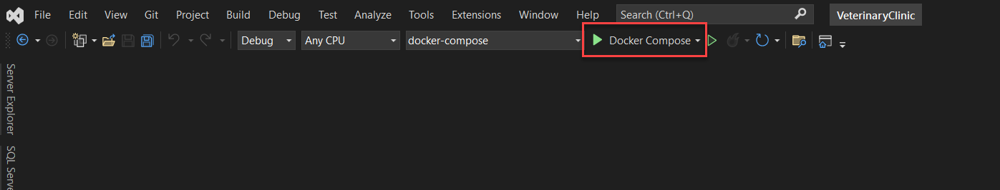
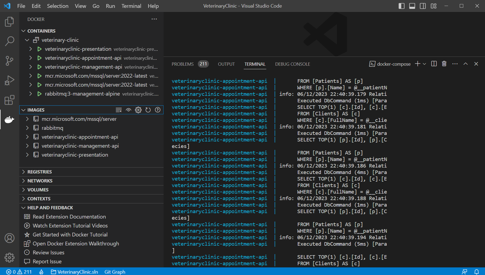

# Ejmplo de Fundamentos en DDD

Codigo de ejemplo de la charla de fundamentos en DDD expuesta en Baufest.

## [1. Prerrequisitos]

Instalar Docker

Instalar Visual Studio 2022 ó Visual Studio Code

## [2. Ejecutar el ejemplo con Visual Studio 2022]
Abrir visual studio 2022 y ejecutar la opcion Docker Compose, como se muestra a continuación.

## [3. Ejecutar el ejemplo con Visual Studio Code]
Abrir Visual Studio Code ubicados al nivel del archivo de docker compose y ejecutar los siguientes comandos:

docker-compose build

docker-compose up

Finalmente los servicios se levantaran como se muestra a continuación.

Para ingresar al proyecto web ir a la URL: http://localhost:7100/

